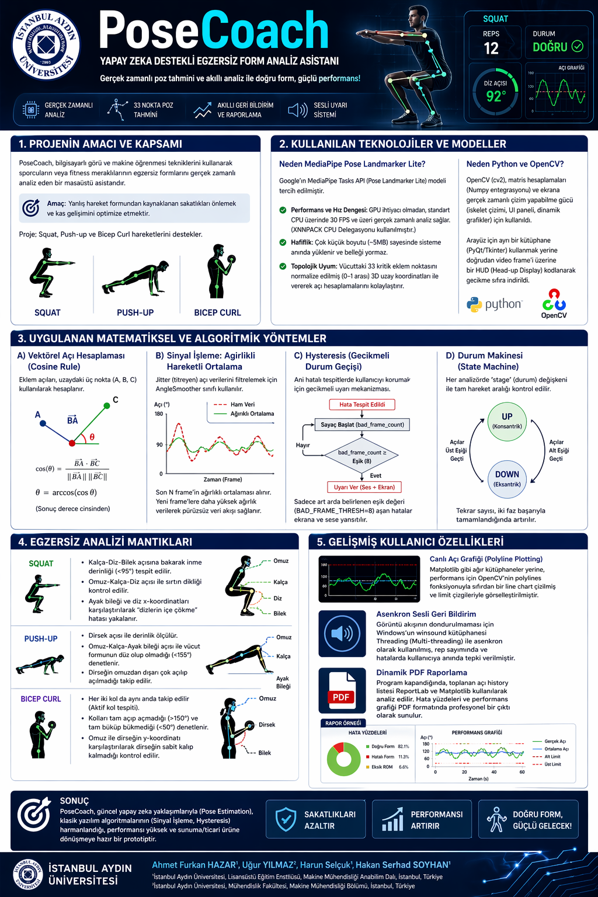

# 🏋️ PoseCoach — Yapay Zeka Destekli Egzersiz Form Analiz Asistanı

> Gerçek zamanlı poz tahmini ve akıllı analiz ile **doğru form, güçlü performans!**



---

## 🎯 Proje Hakkında

**PoseCoach**, bilgisayarlı görü ve makine öğrenmesi tekniklerini kullanarak sporcuların veya fitness meraklılarının egzersiz formlarını gerçek zamanlı analiz eden bir masaüstü asistanıdır.

**Amaç:** Yanlış hareket formundan kaynaklanan sakatlıkları önlemek ve kas gelişimini optimize etmek.

Desteklenen hareketler: **Squat**, **Push-up**, **Bicep Curl**

---

## 🛠️ Kullanılan Teknolojiler

| Teknoloji | Kullanım Amacı |
|-----------|----------------|
| Python | Ana programlama dili |
| OpenCV (cv2) | Gerçek zamanlı video işleme, iskelet çizimi, UI paneli |
| Google MediaPipe Tasks API | 33 noktalı poz tahmini (Pose Landmarker Lite) |
| NumPy | Matris hesaplamaları, vektörel açı hesaplama |
| Matplotlib | Canlı açı grafiği (polyline plotting) |
| Threading | Asenkron sesli bildirim (winsound) |
| ReportLab | Dinamik PDF raporlama |

---

## ⚙️ Algoritmik Yöntemler

### 📐 Vektörel Açı Hesaplama (Cosine Rule)
Eklem açıları, uzaydaki üç nokta (A, B, C) kullanılarak vektörel çarpım ile hesaplanır:

$$\cos(\theta) = \frac{\vec{BA} \cdot \vec{BC}}{||\vec{BA}|| \cdot ||\vec{BC}||}$$

### 📉 Sinyal İşleme — Ağırlıklı Hareketli Ortalama
Titreşen (jitter) açı verilerini filtrelemek için `AngleSmoother` sınıfı uygulanmıştır. Son N frame'in ağırlıklı ortalaması alınarak pürüzsüz veri akışı sağlanır.

### 🔁 Hysteresis — Gecikmeli Durum Geçişi
Ani hatalı tespitlerde kullanıcıyı korumak için gecikmeli uyarı mekanizması:
- `bad_frame_count` sayacı ile hata eşiği (`BAD_FRAME_THRESH=8`) aşılınca ses + ekran uyarısı tetiklenir.

### 🔄 Durum Makinesi (State Machine)
Her analizörde `stage` değişkeni ile tam hareket aralığı kontrol edilir (`UP` / `DOWN` fazları).

---

## 🏃 Egzersiz Analiz Mantıkları

### Squat
- Kalça-Diz-Bilek açısına bakarak iniş derinliği (`<95°`) tespit edilir.
- Omuz-Kalça-Diz açısı ile sırt dikliği kontrol edilir.
- Ayak bileği ve diz x-koordinatları karşılaştırılarak "dizlerin içe çökme" hatası yakalanır.

### Push-up
- Dirsek açısı ile iniş derinliği ölçülür.
- Omuz-Kalça-Ayak bileği açısı ile vücut formunun düz olup olmadığı (`<155°`) denetlenir.
- Dirseğin omuzdan dışarı çok açılıp açılmadığı takip edilir.

### Bicep Curl
- Her iki kol da aynı anda takip edilir (aktif kol tespiti).
- Kolların tam açılmadığı (`>150°`) ve tam bükülmediği (`<50°`) denetlenir.
- Omuz ile dirseğin y-koordinatı karşılaştırılarak dirseğin sabit kalıp kalmadığı kontrol edilir.

---

## ✨ Öne Çıkan Özellikler

- **🎥 Gerçek Zamanlı Analiz** — GPU gerektirmeden, standart CPU üzerinde 30+ FPS
- **🦴 33 Nokta Poz Tahmini** — MediaPipe Pose Landmarker Lite ile hafif (~5MB) model
- **📊 Canlı Açı Grafiği** — Matplotlib polylines ile gerçek zamanlı görselleştirme
- **🔊 Asenkron Sesli Bildirim** — Video akışını dondurmadan anlık uyarı
- **📄 Dinamik PDF Raporlama** — Program kapandığında otomatik performans raporu
- **🖥️ HUD Arayüzü** — Ayrı kütüphane gerektirmeden OpenCV üzerine kodlanmış panel

---

## 🚀 Kurulum

```bash
# Repoyu klonla
git clone https://github.com/KULLANICI_ADIN/PoseCoach.git
cd PoseCoach

# Bağımlılıkları yükle
pip install mediapipe opencv-python numpy matplotlib reportlab
```

> **Not:** `pose_landmarker.task` model dosyası ilk çalıştırmada otomatik indirilir.

---

## 💻 Kullanım

### Yöntem 1 — Kolay Launcher (GUI)
```bash
python launch.py
```
Dosya seçme penceresi açılır, ardından hareket seçilir.

### Yöntem 2 — Komut Satırı
```bash
python pose_coach.py <video_yolu> <hareket>

# Örnekler:
python pose_coach.py squat_video.mp4 squat
python pose_coach.py sinav.mp4       pushup
python pose_coach.py kol.mp4         curl
```

---

## 📁 Proje Yapısı

```
PoseCoach/
├── pose_coach.py              # Ana analiz motoru
├── launch.py                  # GUI launcher
├── create_doc.py              # PDF rapor oluşturucu
├── pose_landmarker.task       # MediaPipe model dosyası
├── PoseCoach_Proje_Dokuman.pdf
└── README.md
```

---

## 🖼️ Arayüz

```
┌──────────────────────────────────┬──────────────┐
│                                  │  SQUAT       │
│   Kamera / Video görüntüsü       │  REPS: 5     │
│                                  │  DOGRU ✅    │
│   ← Yeşil iskelet = doğru form   │              │
│   ← Kırmızı iskelet = hatalı     │  [OK] Diz... │
│                                  │  [!!] Sırt.. │
│                                  │  Form Geçmişi│
│                                  │  ▓▓░▓▓▓░▓▓  │
└──────────────────────────────────┴──────────────┘
```

- 🟢 **Yeşil iskelet** → Form doğru
- 🔴 **Kırmızı iskelet** → Düzeltme gerekiyor
- Alt çubuklar → Son 60 frame'in form geçmişi

---

## 🔮 Geliştirme Fikirleri

- Deadlift, Plank, Shoulder Press desteği
- YOLO ile çok kişili takip
- Roboflow ile özel hareket veri seti eğitimi
- Web arayüzü (Flask/FastAPI + WebRTC)

---

## 📜 Lisans

MIT License

---

## 🙏 Teşekkür

Bu proje, **BTK — Yapay Zeka Destekli Görüntü İşleme Kariyer Atölyesi** (20–24 Nisan 2026, Samsun Teknokent) kapsamında geliştirilmiştir.  
Değerli katkıları ve rehberliği için **Muammer Hocama** teşekkür ederim.
